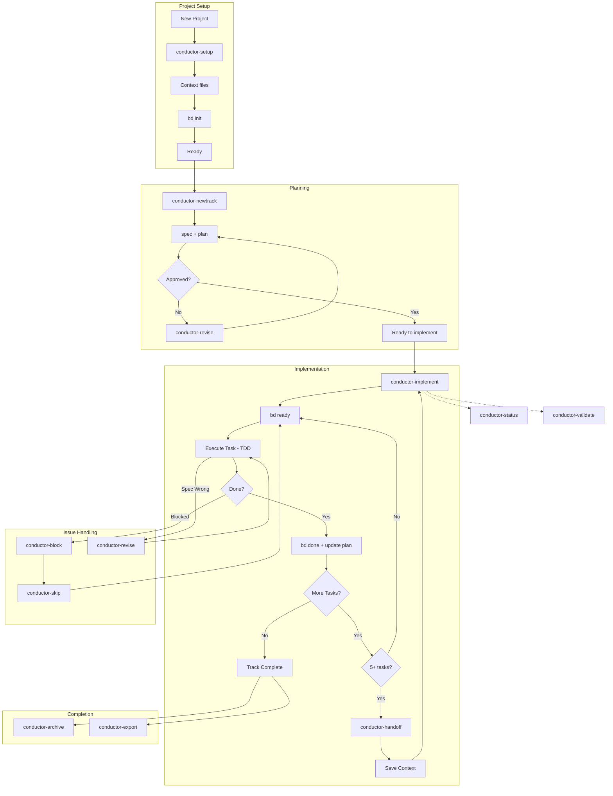
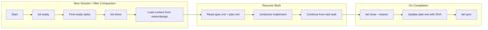

# Conductor-Beads

**Measure twice, code once.**

A unified toolkit for **Context-Driven Development** that combines structured planning with persistent memory. Turn your AI assistant into a proactive project manager that follows a strict protocol: **Context → Spec & Plan → Implement**.

**Version:** 0.1.0

## What is Conductor-Beads?

Conductor-Beads integrates two powerful systems:

- **Conductor** provides the methodology — specs, plans, tracks, and TDD workflows
- **Beads** provides the memory — persistent task tracking that survives conversation compaction

Together, they enable AI agents to manage long-horizon development tasks without losing context across sessions.

## Supported Platforms

- **Amp** - via slash commands and skills
- **Agent Skills compatible CLIs** - via skills specification

---

## Prerequisites

### Install Beads (Required for persistent memory)

Beads provides persistent, structured memory for coding agents. Install using one of these methods:

```bash
# npm (recommended)
npm install -g @beads/bd

# Homebrew (macOS/Linux)
brew install steveyegge/beads/bd

# Go
go install github.com/steveyegge/beads/cmd/bd@latest
```

Verify installation:
```bash
bd --version
```

> **Note:** Beads integration is always attempted for persistent memory. If the `bd` CLI is unavailable or fails, you'll be prompted to choose whether to continue without it.

---

## Installation

**Full Installation** (all skills):
```bash
# Clone the repository
git clone https://github.com/hoangduy0308/Conductor-Beads.git

# Copy commands and skills to your global config
cp -r Conductor-Beads/.agents/commands/* ~/.agents/commands/
cp -r Conductor-Beads/.agents/skills/* ~/.agents/skills/
```

**Minimal Installation** (conductor only, smaller context):
```bash
git clone https://github.com/hoangduy0308/Conductor-Beads.git

# Copy only commands and conductor skill
cp -r Conductor-Beads/.agents/commands/* ~/.agents/commands/
mkdir -p ~/.agents/skills
cp -r Conductor-Beads/.agents/skills/conductor ~/.agents/skills/
```

**Project-Local Installation**:
```bash
# Full - copy entire .agents folder
cp -r Conductor-Beads/.agents your-project/

# Minimal - conductor only
mkdir -p your-project/.agents/skills
cp -r Conductor-Beads/.agents/commands your-project/.agents/
cp -r Conductor-Beads/.agents/skills/conductor your-project/.agents/skills/
```

| Installation | Includes | Best For |
|--------------|----------|----------|
| **Full** | conductor, beads, skill-creator skills | Standalone Beads usage, skill development |
| **Minimal** | conductor skill only (has Beads integration) | Most projects, smaller context window |

---

## Setup Guide

### Step 1: Initialize Your Project

Run the setup command in your project directory:

```bash
/conductor-setup
```

This creates the `conductor/` directory with:
- `product.md` - Product vision and goals
- `tech-stack.md` - Technology choices
- `workflow.md` - Development standards (TDD, commits)
- `tracks.md` - Master track list

**Deep Research:** Setup now uses `exa-code` + `Oracle` for Greenfield projects, `gkg` + `Oracle` for Brownfield projects to provide informed recommendations.

### Step 2: Initialize Beads

After Conductor setup, initialize Beads for persistent memory:

```bash
# Standard mode (commits to repo)
bd init

# Stealth mode (local-only, for shared repos)
bd init --stealth
```

This creates `.beads/` directory for dependency-aware task tracking.

### Step 3: Configuration

After setup, `conductor/beads.json` controls integration:
```json
{
  "enabled": true,
  "mode": "stealth",
  "sync": "bidirectional",
  "compactOnArchive": true
}
```

**Mode Options:**

| Mode | Command | Description |
|------|---------|-------------|
| `"normal"` | `bd init` | Full integration. Commits `.beads/` to repo. Team members see tasks. |
| `"stealth"` | `bd init --stealth` | Local only. `.beads/` is gitignored. Personal use on shared repos. |

Use **stealth** when working on a shared repository where you don't want to commit Beads data. Use **normal** when the whole team uses Beads.

---

## Implementation Guide

### Creating a New Track

```bash
/conductor-newtrack "Add user authentication"
```

This creates:
- `conductor/tracks/<track_id>/spec.md` - Requirements
- `conductor/tracks/<track_id>/plan.md` - Phased task list
- `conductor/tracks/<track_id>/metadata.json` - Track metadata
- Beads epic (if enabled): `bd-xxxx`

### Implementing a Track

```bash
/conductor-implement
```

The workflow:
1. **Load context** - Reads spec.md and plan.md
2. **Find ready tasks** - Uses `bd ready` if Beads enabled
3. **Execute TDD** - Write test → Implement → Refactor
4. **Track progress** - Updates plan.md and Beads status
5. **Verify** - Manual verification at phase boundaries

### Parallel Task Execution

For phases with independent tasks, Conductor can execute them in parallel using sub-agents:

```markdown
## Phase 1: Core Setup
<!-- execution: parallel -->

- [ ] Task 1: Create auth module
  <!-- files: src/auth/index.ts, src/auth/index.test.ts -->
  
- [ ] Task 2: Create config module
  <!-- files: src/config/index.ts -->
```

**How it works:**
1. During `/conductor-newtrack`, you'll be asked if you want parallel execution
2. Tasks are analyzed for file conflicts and dependencies
3. During `/conductor-implement`, parallel phases spawn sub-agents
4. Each sub-agent works on exclusive files with TDD workflow
5. Results are aggregated when all workers complete

**Benefits:**
- ⚡ Faster execution for independent tasks
- 🔒 File locking prevents conflicts
- 📊 State tracking via `parallel_state.json`

See [Parallel Execution Design](docs/PARALLEL_EXECUTION.md) for details.

### Checking Status

```bash
/conductor-status
```

Shows:
- Active tracks with progress
- Ready tasks (from Beads)
- Blocked items

---

## Commands Reference

| Command | Description |
|---------|-------------|
| `/conductor-setup` | Initialize project context |
| `/conductor-newtrack` | Create feature/bug track |
| `/conductor-implement` | Execute tasks from plan |
| `/conductor-status` | Show progress overview |
| `/conductor-revert` | Git-aware revert |
| `/conductor-validate` | Validate project integrity |
| `/conductor-block` | Mark task as blocked |
| `/conductor-skip` | Skip current task |
| `/conductor-revise` | Update spec/plan |
| `/conductor-archive` | Archive completed tracks |
| `/conductor-export` | Generate project summary |
| `/conductor-handoff` | Create context handoff |
| `/conductor-refresh` | Sync context with codebase |

### Essential Beads Commands

| Command | Description |
|---------|-------------|
| `bd ready` | List tasks with no blockers |
| `bd create "Title" -p 0` | Create a P0 (highest priority) task |
| `bd show <id>` | View task details, notes, and context |
| `bd close <id> --reason "Done"` | Complete task with summary |
| `bd update <id> --notes "context"` | Add notes for session resume |
| `bd dep add <child> <parent>` | Add dependency between tasks |
| `bd sync` | Force sync to remote (use at session end) |

---

## Skills

Located in `.agents/skills/`:

| Skill | Description |
|-------|-------------|
| **conductor** | Context-driven development methodology. Auto-activates when `conductor/` directory exists. Provides intent mapping for natural language commands. |
| **beads** | Persistent task memory that survives conversation compaction. Auto-activates when `.beads/` directory exists. Integrates with Conductor for cross-session memory. |
| **planning** | Discovery, risk assessment, and spike workflow for complex features. Use for large, multi-module features that need careful planning. |
| **filing-beads** | Structured bead creation with dependencies and priorities. Creates epics and tasks in Beads. |
| **reviewing-beads** | Quality gate for beads. Reviews issues for clarity, completeness, and correct dependencies before implementation. |
| **orchestrating-beads** | Multi-agent parallel execution with Agent Mail. Spawns worker agents for parallel track execution. |
| **skill-creator** | Guide for creating and packaging new AI agent skills. |

### Planning Pipeline (for complex features)

For large, multi-module features that need discovery and risk assessment, use the planning skill pipeline:

```
┌─────────────────────────────────────────────────────────────────┐
│                         USER CHOICE                             │
├───────────────────────────┬─────────────────────────────────────┤
│     /conductor-newtrack   │         planning skill              │
│     (classic mode)        │         (full pipeline)             │
├───────────────────────────┼─────────────────────────────────────┤
│ • Bug fix (1-5 files)     │ • Large feature (multi-module)      │
│ • Small chore/refactor    │ • External integration (APIs)       │
│ • Known location          │ • Unknown scope (needs discovery)   │
│ • Low risk                │ • HIGH risk (needs spikes)          │
└───────────────────────────┴─────────────────────────────────────┘
```

**Pipeline flow:**
```
planning skill → filing-beads → reviewing-beads → /conductor-newtrack --import → orchestrating-beads
```

**What the pipeline provides:**
- **Discovery**: Parallel agents explore codebase with gkg, librarian, exa
- **Risk Assessment**: Oracle analyzes gaps, identifies HIGH/MEDIUM/LOW risks
- **Spikes**: Validate HIGH risk items before committing to implementation
- **Quality Gate**: reviewing-beads ensures beads are clear and complete
- **Multi-Agent Execution**: orchestrating-beads spawns parallel workers with Agent Mail

### How Skills Work

Skills auto-activate based on project structure:
- `conductor/` directory → Conductor skill loads
- `.beads/` directory → Beads skill loads
- Both present → Integrated workflow enabled

Skills provide:
- **Context Loading**: Automatically reads relevant project files
- **Intent Mapping**: Converts natural language to commands
- **Proactive Behaviors**: Suggests next steps and detects issues

---

## Project Structure

### Repository Structure

```
Conductor-Beads/
├── .agents/
│   ├── commands/        # Slash commands (13)
│   └── skills/          # Skills (conductor, beads, planning, filing-beads, reviewing-beads, orchestrating-beads, skill-creator)
├── templates/           # Workflow and styleguide templates
├── docs/                # Documentation
└── AGENTS.md            # Agent context
```

### Generated Project Structure

When you run Conductor on a project:

```
your-project/
├── conductor/
│   ├── product.md           # Product vision
│   ├── tech-stack.md        # Technology choices
│   ├── workflow.md          # Development standards
│   ├── tracks.md            # Master track list
│   ├── beads.json           # Beads integration config
│   └── tracks/
│       └── <track_id>/
│           ├── spec.md      # Requirements
│           ├── plan.md      # Task list
│           └── metadata.json
└── .beads/                  # Beads data (if initialized)
```

---

## Status Markers

Throughout conductor files:
- `[ ]` - Pending/New
- `[~]` - In Progress
- `[x]` - Completed
- `[!]` - Blocked

---

## Workflow Diagrams

### Complete Workflow



### Session Resume Flow (with Beads)



### Quick Reference Patterns

| Pattern | Command Flow |
|---------|--------------|
| **Happy Path** | `setup` → `bd init` → `newtrack` → `implement` → `archive` |
| **Multi-Section** | `implement` → *(5+ tasks)* → `handoff` → *(new session)* → `implement` |
| **Handle Blockers** | `implement` → `block` → `skip` or wait → `implement` |
| **Mid-Track Changes** | `implement` → `revise` → `implement` |
| **Session Resume** | `bd ready` → `bd show --notes` → load spec → `implement` |
| **Monitoring** | `status` / `validate` *(anytime)* |
| **Context Drift** | `refresh` *(when codebase changed outside Conductor)* |

---

## Documentation

- [Manual Workflow Guide](docs/manual-workflow-guide.md)
- [Beads Integration](docs/BEADS_INTEGRATION.md)
- [Beads Official Docs](https://github.com/steveyegge/beads)

---

## License

[Apache License 2.0](LICENSE)
